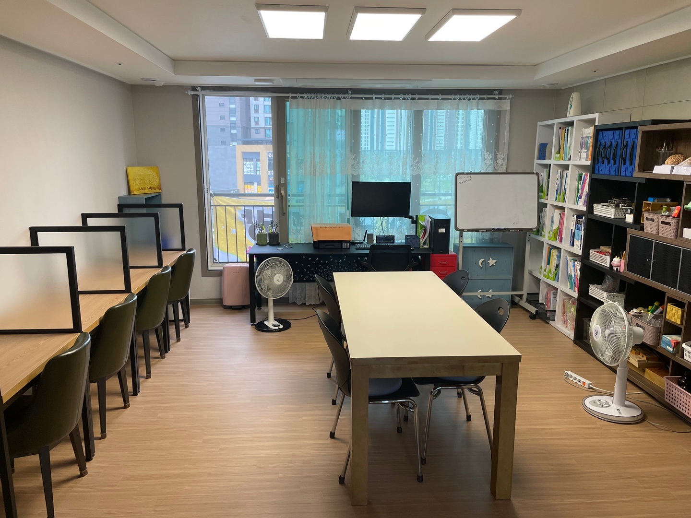

# 저를 소개합니다

{: .align-center width="40%"}

## Skill
- LANGUAGE
  - Python, Javascript

- Data Base
  - MongoDB, MySQL, Firebase

## Jango Framework Homepage
- 회원관리를 위한 '[오투공부방](http://leeyj85.shop/o2study/)' 페이지 제작
- 회원 출결 시스템, 공지사항, 질문게시판, 회원 포인트시스템 운영

## 저의 삶

### 과거...
10년 넘게 다니던 안정적인 직장을 그만두고... 
2022년 이직 결정🗽  

### 현재...
'[오투공부방](http://leeyj85.shop/o2study/)'을 아내와 함께 운영📚  

{: .align-center width="60%"}

새로운 직장을 얻기 위해 코딩 공부중💻  

### 미래...
사랑하는 가족과 함께 밝은 미래😃🌈  

{: .align-center width="70%"}

